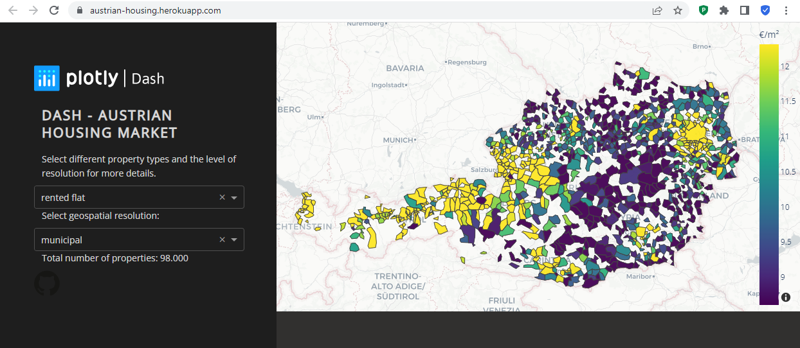

# Austrian Stats
This is my Austrian data visualisation web app. Data is pulled from the Austrian Statistical Agency.
This plotly Dash app is deployed on Heroku.  

This app can be viewed live using this link on Heroku platform: [https://austrian-stats.herokuapp.com/](https://austrian-stats.herokuapp.com/)

## File Structure

`app.py` where the dash app lives  
`requirements.txt` python modules that will be installed onto the Heroku Dyno process (your linux webserver) at build  
`runtime.txt` simply tells Heroku (the Gunicorn HTTP server) which Python version to use  
`Procfile` tells Heroku what type of process is going to run (Gunicorn web process) and the Python app entrypoint (app.py)  
`/assets` this directory is to serve the CSS files, images and favicon icon.  
`/data` this folder contains the geojson data as well as the actual data source as .csv source  
`.gitignore` file telling git which files and directories to ignore when pushing to the remote repositories  
