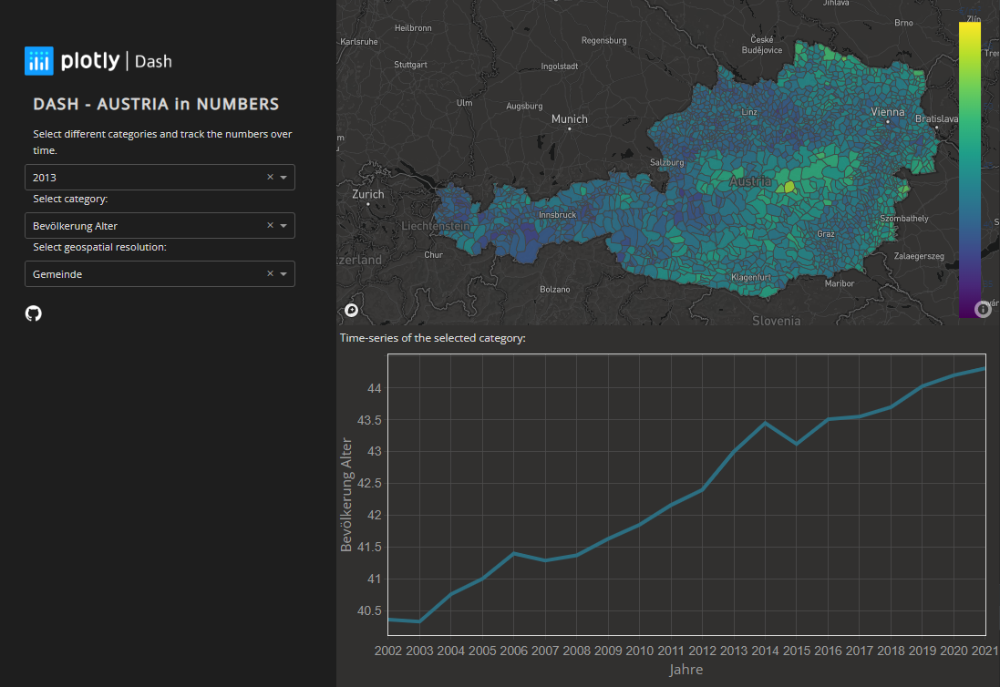

# Dash-heroku
A running starter pack for deploying a Plotly Dash app on Heroku with support for hosting static files, such as images (a common pain point).  

This app can be viewed live on Heroku at [https://austrian-housing.herokuapp.com/](https://austrian-housing.herokuapp.com/)

## File Structure

`app.py` where the dash app lives  
`requirements.txt` python modules that will be installed onto the Heroku Dyno process (your linux webserver) at build  
`runtime.txt` simply tells Heroku (the Gunicorn HTTP server) which Python version to use  
`Procfile` tells Heroku what type of process is going to run (Gunicorn web process) and the Python app entrypoint (app.py)  
`/assets` this directory is to serve the CSS files, images and favicon icon.  
`/static` this is the directory from which you can serve all your static files (note this is seen as the root folder from your Dash app)  
`.gitignore` file telling git which files and directories to ignore when pushing to the remote repositories  

## Instructions

A full step-by-step guide is provided below to help you get your first Heroku app live. 
If you are a first-timer on Heroku, I suggest you get this starter app running on Heroku first, then you can adapt it to suit your needs by copy-pasting your locally running Dash app code across etc. 
Heroku also has a concise guide for [getting started on Python](https://devcenter.heroku.com/articles/getting-started-with-python) which is a useful reference.
  

## 1. Clone this repo to your local machine and install modules

It's a good idea to check you can get this app running on your local webserver before attempting to deploy on Heroku.
Setup your virtualenv (or don't) and ensure you have all the modules installed before running the app. 

**Install modules from the requirements.txt**  
You should be able to do this with pip3 or conda from a terminal in the project root folder

`pip3 install -r requirements.txt`  
`conda install --file requirements.txt` (if you are using Anaconda)
  
Creating the requirments.txt can be done with:
`pip freeze > requirements.txt` or 
`pipreqs /path/to/project`. Pipreqs needs to be installed separately. 

## 2. Test the app locally

Run the app from your IDE direct, or from the terminal: `python3 app.py`

If it runs, it should be visible on the browser via `http://0.0.0.0:8050`
  

## 3. Setup Heroku command-line-interface (CLI)

Depending on your OS, you may also need to install Git. Follow the general Heroku CLI [installation guide](https://devcenter.heroku.com/articles/heroku-cli). 
  

## 4. Create a Heroku account

You will also need a Heroku account (free tier is fine for a hobby app). Sign up [here](https://signup.heroku.com/login).
  

## 5. Login to Heroku via CLI

From your terminal window, login to Heroku CLI. This will open a browser window and you will need to login to your new Heroku account. 
Once done, return to your terminal and it should say 'Logged in as .... '

`heroku login`
  

## 6. Create a Heroku app linked to the Dash app

Now we must create a Heroku app that will magically link to your Dash app. ENSURE YOU ARE IN THE DASH PROJECT ROOT FOLDER IN A TERMINAL. Heroku docs on this step [here](https://devcenter.heroku.com/articles/getting-started-with-python#deploy-the-app).

`heroku create`

The above command will create your heroku app with a special unique name on the Heroku infrastructure. This name will be part of the public URL that gets created for your live app on the Heroku subdomain. So if you want a custom name that is a bit more intelligible, you can specify a name, but note Heroku will give an error if that name is already taken on their subdomain (by another Heroku user). So you may need to make it highly specific. 

`heroku create youruniqueappname`

You may need to try a few different options to find a unique name, but once done, your public URL will be prettier and easier to remember.
  

## 7. Deploy your app on Heroku

We are ready for the magic to begin. We will now do a Git push command to your remote Heroku app repository (which lives behind the scenes) and this will trigger a build of your Heroku app! 

`git push heroku main`

You should begin to see a bunch of console output in the terminal as Heroku deploys your app. Note it takes about 3 minutes. It should work fine on this repo, but as you add your own code in, be ready to watch for errors. Tip: as soon as the build finishes, bring up the live log tail with `heroku logs --tail`. This will show you the processes happening immediately after the build: Gunicorn web process trying to bring up your app.
   

## 8. View in a browser

If the build succeeds, you will be given a URL at the end that might look something like [https://your-app-name.herokuapp.com/](https://austrian-housing.herokuapp.com/) (this is live so you can see the app deployed). 
Copy paste the URL from your console output into a browser, and your app should be live. Or just type: `heroku open`
  